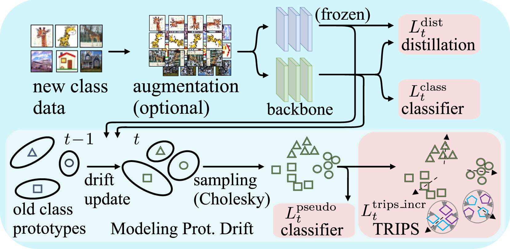

# TRIPS

This is the official repository for the CVIU 2024 Journal article: [Multivariate Prototype Representation for Domain-Generalized Incremental Learning](https://www.sciencedirect.com/science/article/pii/S1077314224002960)

<!-- markdownlint-disable first-line-h1 -->
<!-- markdownlint-disable html -->
<!-- markdownlint-disable no-duplicate-header -->

<p align="center">
  <a href="https://github.com/csiro-robotics/TRIPS/commits/main">
    
  </a>
  <a href="https://github.com/csiro-robotics/TRIPS/issues">
    
  </a>
  <a href="https://github.com/csiro-robotics/TRIPS/pulls">
    
  </a>
  <a href="https://github.com/csiro-robotics/TRIPS/stargazers">
    
  </a>
</p>

## Overview

In this paper, we address the critical yet less explored Domain-Generalized Class-Incremental Learning (DGCIL) task. We propose a DGCIL approach designed to memorize old classes, adapt to new classes, and reliably classify objects from unseen domains. Specifically, our loss formulation maintains classification boundaries while suppressing domain-specific information for each class. Without storing old exemplars, we employ knowledge distillation and estimate the drift of old class prototypes as incremental training progresses. Our prototype representations are based on multivariate Normal distributions, with means and covariances continually adapted to reflect evolving model features, providing effective representations for old classes. We then sample pseudo-features for these old classes from the adapted Normal distributions using Cholesky decomposition. Unlike previous pseudo-feature sampling strategies that rely solely on average mean prototypes, our method captures richer semantic variations. Experiments on several benchmarks demonstrate the superior performance of our method compared to the state of the art.




This github hosts the code for implementing the TRIPS algorithm for the Domain-Generalized Class-Incremental Learning (DGCIL) task, as presented in our paper:

## [Multivariate Prototype Representation for Domain-Generalized Incremental Learning]

Can Peng, Piotr Koniusz, Kaiyu Guo, Brian C. Lovell, Peyman Moghadam. 

[arXiv preprint](https://arxiv.org/pdf/2309.13563.pdf).
[CVIU Open ACCESS](https://doi.org/10.1016/j.cviu.2024.104215) 

## Installation
This DGCIL_TRIPS implementation is based on DomainBed. Therefore the installation is the same as the original DomainBed benchmark.

Please check [requirements](https://github.com/csiro-robotics/DomainGeneralizedCIL/blob/main/requirements.txt) for environment requirements. 

You may also want to see the original README of [DomainBed](https://github.com/facebookresearch/DomainBed).

## Training

**train_all.py**: the training file for the base and incremental tasks. 

**run_script**: To conduct experiments using various datasets or methods, please refer to the respective shell script files located in the 'run_script' folder.

## Citations

Please consider citing the following paper in your publications if it helps your research.

```latexlatex
@article{PENG2024TRIPS,
title = {Multivariate prototype representation for domain-generalized incremental learning},
author = {Can Peng and Piotr Koniusz and Kaiyu Guo and Brian C. Lovell and Peyman Moghadam},
journal = {Computer Vision and Image Understanding},
volume = {249},
pages = {104215},
year = {2024},
issn = {1077-3142}
}
```

## Acknowledgements
Our project references the codes in the following repos. We thank the authors for making their code public.
* [DomainBed](https://github.com/facebookresearch/DomainBed)
* [SWAD](https://github.com/khanrc/swad)


